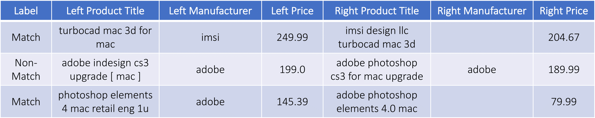

##################
DeepMatcher
##################

DeepMatcher is a python package for performing entity matching using deep learning. It
provides built-in neural networks and utilities that enable you to train state-of-the-art
deep learning models for entity matching using just 5 lines of code. The models are
also easily customizable - they are modular and any subcomponent can be altered or swapped
out for a custom implementation.

As an example, given labeled tuple pairs such as the following:

DeepMatcher trains a neural network to perform matching, i.e., to predict
match / non-match labels. The trained network can then be used obtain labels for unseen
tuple pairs or text sequences.

This package is the official PyTorch rewrite of the code for the paper
`Deep Learning for Entity Matching`_ (SIGMOD '18). All the publicly available datasets used
in the paper can be found at `Prof. AnHai Doan's data repository`_.

This package is currently in early-release alpha. Please report any
crashes / bugs / problems you encounter while using this package.

**********
Quick Start: DeepMatcher in 30 seconds
**********

.. highlight:: python

There are four main steps in using DeepMatcher:

1. Data processing: Load and process labeled training, validation and test CSV data.::

  import deepmatcher as dm
  train, validation, test = dm.data.process(path='data_directory',
      train='train.csv', validation='validation.csv', test='test.csv')

2. Model definition: Specify neural network architecture. Uses a built-in architecture by
default. Can be customized to your heart's desire.::

  model = dm.MatchingModel()

3. Model training: Train neural network.

  model.run_train(train, validation, best_save_path='hybrid_model.pth')

4. Application: Evaluate model on test set and apply to unlabeled data.

  model.run_eval(test)

  unlabeled = dm.data.process_unlabeled(
    path='data_directory/unlabeled.csv',
    trained_model=model)
  model.run_prediction(unlabeled)

**********
Installation
**********

DeepMatcher is under active development, installing directly from GitHub is recommended:::

  pip install --process-dependency-links git+https://github.com/sidharthms/deepmatcher

**********
Tutorials
**********

Using DeepMatcher
=================

1. `Getting Started`_: A more in-depth guide to help you get familiar with the basics of
using DeepMatcher.
2. `Data Processing`_: Advanced guide on what data processing involves and how to
customize it.
3. `Matching Models`_: Advanced guide on the neural network architecture used for entity
matching and how to customize it.

Entity Matching
=================

`End to End entity matching with DeepMatcher and Magellan`_: This tutorial demonstrates a
complete entity matching workflow, i.e., how to obtain matching tuple pairs given two
tables. This involves blocking, sampling, labeling and matching.

**********
Support
**********

If you run into any issues or have questions about this package, please file GitHub
issues.

**********
The Team
**********

DeepMatcher was developed by University of Wisconsin-Madison grad students Sidharth Mudgal
and Han Li, under the supervision of Prof. AnHai Doan and Prof. Theodoros Rekatsinas.

.. _`Deep Learning for Entity Matching`: http://pages.cs.wisc.edu/~anhai/papers1/deepmatcher-sigmod18.pdf
.. _`Prof. AnHai Doan's data repository`: https://sites.google.com/site/anhaidgroup/useful-stuff/data
.. _`Getting Started`: https://nbviewer.jupyter.org/github/sidharthms/deepmatcher/blob/master/examples/getting_started.ipynb
.. _`Data Processing`: https://nbviewer.jupyter.org/github/sidharthms/deepmatcher/blob/master/examples/data_processing.ipynb
.. _`Matching Models`: https://nbviewer.jupyter.org/github/sidharthms/deepmatcher/blob/master/examples/matching_models.ipynb
.. _`End to End entity matching with DeepMatcher and Magellan`: https://nbviewer.jupyter.org/github/sidharthms/deepmatcher/blob/master/examples/end_to_end_em.ipynb
